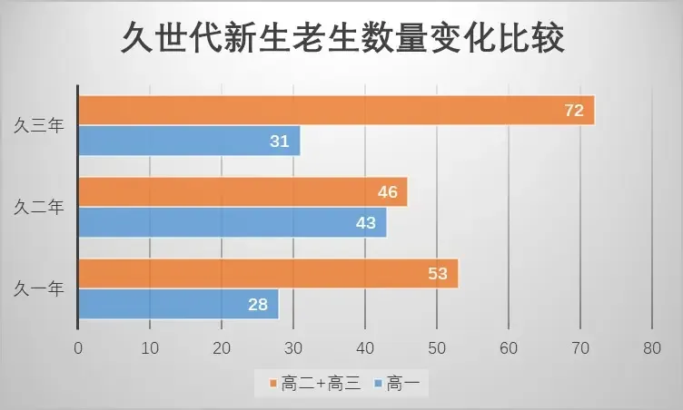

&emsp;&emsp;**久二年北宇治吹奏部止步于关西大赛的故往，是北宇治吹奏部崛起过程中的最大挫折。正是在此之后，北宇治吹奏部进行了反思与更深入的变革，卧薪尝胆，发奋图强，最终在久三年捧回了全国金奖。从此北宇治吹奏部盘踞京都，称雄关西，虎视全国。然而，随着久世代的毕业，吹奏部中对此事保有记忆的人将越来越少。刻骨铭心的记忆会随着时间淡化，遗忘前人教训的后辈会大意地第二次掉进河流。是故，在新一届内阁的指导下，我们以旁观者的视角，对那次挫败进行了分析与总结。**

&emsp;&emsp;**在失败的原因分析与经验的总结之外，我们特意对彼时北宇治的两位重要领袖进行了研究，客观审慎地评判了他们的事迹。今后的年代要求有更具有远见卓识的领导者。有人说，那些不研究历史的人必然会被迫重复历史，而相反，如果一个时代的领路人比他们的前任看得更远，那是因为他们站在先行者的肩膀上。我们的研究探讨的是过去失败的原因，批判与评价的是历史上的人物，但却是为未来的成功所写，为未来的领袖们所写。**

南中权力集团

# **黑犀牛：龙圣崛起**

&emsp;&emsp;有人说，久二年吹奏部止步关西大赛的唯一原因在于龙圣异军突起。一个可靠的根据是吉川部长在赛后总结时所说：“说老实的，我认为今年我们的实力比去年更强，得到评委不少好评”，“我们之所以没进全国，不是我们变弱了，而是别人更强了”。如果说吹奏部久一年进军全国是侥幸，久三年全国金是志在必得，那么实力介于二者之间的久二年吹奏部却拿到了这三年的最差结果，原因只能在于外界。但复盘结果并不支持这一观点。

北宇治会变得更好！变得更加强大！

&emsp;&emsp;月咏源一郎调任龙圣原本是一只“灰犀牛”（大概率的系统性风险），在久二年初就被预警，但由于缺乏相应的认识，这只奔跑的灰犀牛并未引起吹奏部大家的重视。北宇治本是最能够预见到“灰犀牛”的风险的社团。久二年的龙圣与久一年的北宇治何其相似？京都府赛铜赏实力的孱弱社团，因为一位杰出的新顾问而焕然一新。以及，吹奏部顾问泷升曾亲口承认自己实力不如月咏源一郎，樋口也告知了吹奏部龙圣切切实实的改变。是故龙圣的潜在实力可能甚于久一年吹奏部。因此将击败大阪三强之一作为进军全国的充分条件的前提便不复存在。直到关西大赛宣布成绩后，这只“灰犀牛”突然演变为“黑天鹅”，倏忽之间，北宇治便与全国大赛资格失之交臂。

&emsp;&emsp;除了龙圣这一只“黑犀牛”以外，被忽视的还有一只“黑天鹅”明静工科。当人们惊讶于“黑犀牛”的偶然与持久的破坏力时，另一只“黑天鹅”悄然飞起。杰出顾问的调任，往往导致吹奏部实力的下降。然而，月咏源一郎从明静工科调走后，明静工科的新顾问表现出了的依旧强悍的实力，稳稳地保住了明工全国金的位次。明静工科体现出的绝对掌控力实在是出人意料。如果明工因为月咏源一郎的调走实力有小幅下滑而与另外两强并驾齐驱，那么北宇治的机会便大大增加了。因此原本呈现在久二年吹奏部面前的，本是比久一年更好的局势：自身实力日益增长，裹挟久一年挑落三强之一的余威，面对实力可能衰弱的对手，这些给予了吉川内阁充足的信心。

&emsp;&emsp;诚然，如果这一切不可避免，那么久二年止步关西的挫败就是不得不咽下的苦果。然而，事实上却是，吹奏部在事情尚有挽回余地时有意无意地放弃了所有的可能性，独独选择了埋头狂奔，致使自食其果饮恨关西。孙子说：“知己知彼，百战不殆。”北宇治未能建立合理的机制做到料敌于前，便在“黑犀牛”与“黑天鹅”的作用下败北。必须指出，时至今日我们仍然未能建立起一套相关的机制应对类似的不确定性。倘若出现月咏源一郎第二，我们的应对可能仍与久二年的吹奏部同样盲目且无知。

&emsp;&emsp;龙圣的崛起，具有“黑天鹅”的突发性与“灰犀牛”的冲击惯性，深远的影响一直到今天。从久二年与久三年的结果看，龙圣的实力凌驾于秀塔附中与大阪东照之上。全国大赛的名额只有三个，因此我们必须至少能够击败大阪两强，才有可能进入全国大赛；击败明静工科或者龙圣，才能够稳操胜券。这无疑带来了更严峻的挑战，对吹奏部的实力提出了更高的要求。

**毫无疑问，对黑马龙圣毫无防备是北宇治折戟关西大赛的最大因素。然而，倘若仅仅如此，未免太过侥幸。我们认为，久二年的吹奏部内一些结构性的问题可能起到了推波助澜的作用。**

# **双刃剑：年龄结构的阵痛**

&emsp;&emsp;在关西乃至全国的诸多强校的吹奏部内，三年级生均是毫无疑问的最有实力的组成部分。三年级生的数量与吹奏部的表现有着较强的相关性。由此可见，南中派的出走对于北宇治吹奏部的影响无疑是消极的，使久二年三年级生的数量相对于一般年份减少了三分之一还强。

&emsp;&emsp;与此相对，久二年新生入部是最多的，久二年的一年级生数量相当于二年级生与三年级生的总和，如下图：

久一年与久三年吹奏部的一年级生与老生的比例在0.5左右波动

&emsp;&emsp;久二年一年级生的涌入是否拖累了吹奏部整体的表现？我们认为是可能的。对于各小组而言，更多的新生意味着需要消耗老生更多的精力在指导上；对于整个吹奏部而言，如何解开新生心中的结与帮助他们融入新环境是一项艰巨的任务。请注意，这些任务的繁重性至少是其它年份的两倍。即使久二年入部的新人中不乏优秀者，我们依然认为相应的工作量是巨大的。

&emsp;&emsp;当更少的三年级生与爆发的一年级生两个因素相叠加，便发挥出了更大的影响。下图给出了久世代的年龄结构，久一年是沙漏型，久二年是金字塔型，久三年是纺锤型。可以清晰地看见，久一年吹奏部的青黄不接，久二年的新生工作的压力，与久三年享受的人口红利。对于校园社团而言，各年级的成员数量相近是比较健康的。久二年的吹奏部显然背离了这一标准。但是与此相对，久三年享受了一波丰厚的人口红利，顺势完成了吹奏部的复兴。

&emsp;&emsp;基于以上分析，我们的建议是：在新的一年将一年级生的数目控制在37人左右。这将有利于今年继续冲击全国金奖。虽然届时吹奏部部员总数可能达到史无前例的111人，但是仍然在可接受范围内。利用吹奏部目前的人口红利，培养更多的人才，有利于未来北宇治实力的保持。

芝麻开花节节高

# **变革的困顿：权力集中与制衡**

&emsp;&emsp;久二年是北宇治复兴中特殊的一年：改革进入了深水区，前路尚未明朗，挫折却接踵而至。没有翻不过的山，没有趟不过的河。过去的失败或成功都成为了今天我们的经验，我们站在前辈的肩膀上，摘取树上的果实。

&emsp;&emsp;久二年吹奏部面对的诸多难题最值得探讨的是北宇治特色内阁政体下如何在权力集中与效率之间平衡。现在吉川内阁与黄前内阁告诉了我们这个答案，那就是部长+副部长+领队的三驾马车结构，与声部长制度的结合。这一制度保证了吹奏部的高效运行。但是久二年的吹奏部架构却与之完全不同，可以说是前无古人后无来者，是变革中探索的产物。

南中集团在工作

&emsp;&emsp;首先，久二年的吹奏部存在一定程度上的双重管理。彼时不仅仅设立了声部长，还设立了年级代表这一职位。年级代表的作用是什么，在北宇治吹奏部的主要历史著作《黄前久美子本纪》中已经不可考。但我们从《黄前久美子本纪》久三年部分中不再出现这一职位可以推断，这一职位实际设立的意义不大，完全可以由其它岗位替代。那么在久二年的吹奏部，同一套人马，需要接受两套班子的直接指挥，其中的冲突与协调是不可避免的。。

&emsp;&emsp;最重要的是，部长吉川优子将大部分事务揽到了自己的身上，作为北宇治吹奏部的大家长，她的权力达到了巅峰，但是随之而来的是身体的严重消耗，她的身体事实上也成为了北宇治吹奏部的一个不稳定因素。倘若没有副部长中川夏纪在一旁辅佐与劝导，吉川优子可能会在一个意外的时刻倒下。除此之外，我们还应该反思，为什么久二年的吹奏部的主要部务有四人分担，可部长吉川优子几乎累趴下？原因在于彼时的吹奏部没有清晰的界定权力的界限，吉川优子轻易的大权独揽。大权独揽也导致吹奏部带上了吉川优子过多的个人色彩，为什么小日向梦没能吹上第一音程？为什么高坂丽奈说吹奏部太放松了？《黄前久美子本纪》中并没有避讳相关的内容，吉川优子也进行了反思。结果是，在黄前的内阁中，权力的界限被明确地区分，吹奏部在三人的领导下高速运转。

黄主席其人

&emsp;&emsp;最后，内阁成员的指派也是一个值得深思的问题。中川夏纪在《黄前久美子本纪》中承认，幸亏担任副部长的是自己。我们对此观点表示怀疑。一个合格的副部长需要做的不仅仅是给部长加油打气与分担工作，还应当有自己的见解，以及拒绝部长的魄力。为什么中川夏纪没能够制衡吉川优子的大权独揽，这一点值得我们深思。

# 拓展阅读

* [黄前后世代北宇治吹奏部核心权力之争​](/2020/03/18/黄前后世代北宇治吹奏部核心权力之争)

* [吉川优子：承前启后的领路人​](/2020/04/05/吉川优子_承前启后的领路人)

* [伞木希美：别问吹奏部能为你做什么，问问你能为吹奏部做什么​](/2020/04/05/别问为你问你能为)

