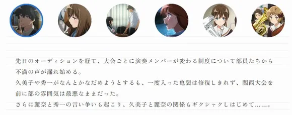

# 声部首席会议记录

&emsp;&emsp;京吹3第9集，声部首席会议上，声部长与丽奈的争论是动画原创剧情。而对于这次会议矛盾的焦点，很多人似乎理解有偏差。首先把会议记录全部贴上：

>&emsp;&emsp;久美子：那么，还有人想说什么吗？
>
>&emsp;&emsp;森本：我有，之前在选拔中落选的人很消沉。
>
>&emsp;&emsp;牧誓：是啊，我那也有。
>
>&emsp;&emsp;森本：我本想鼓励他们说下次还有机会……
>
>&emsp;&emsp;小绿：可现在我们也说不准。
>
>&emsp;&emsp;井上顺菜：问题就是要怎么让他们保持动力了。
>
>&emsp;&emsp;丽奈：我觉得不想努力的人就不用管他们了。
>
>&emsp;&emsp;秀一：那怎么行，还要考虑明年后年呢！
>
>&emsp;&emsp;久美子：有些事也能靠时间解决，就保持关注，时机合适的时候跟他们聊聊吧？
>
>&emsp;&emsp;森本：明白了。
>
>&emsp;&emsp;牧誓：只是，我们其实也没有太多余力啊，一想到就算进了全国赛也还有选拔……
>
>&emsp;&emsp;井上：比起去年来，社团里的气氛也更沉重。
>
>&emsp;&emsp;丽奈：我觉得有这种程度的紧张感是好事，比起去年，曲子的完成度也确实提高了。
>
>&emsp;&emsp;森本：虽然是这个道理……

&emsp;&emsp;这段对话的讨论焦点是什么？森本和牧誓到底想干什么？ 

# 表面议题

&emsp;&emsp;表面上看，森本是提出了一个问题，该如何安抚选拔落选的成员？放置不管则社团没法培养新人（日本学校社团基本是前辈指导后辈练习的模式，顾问老师直接教学的时间反而不多，京吹动画也有体现这点）；去管的话，声部首席自己现在也很忙，没有精力，这是个两难。 

&emsp;&emsp;唯一正确的解决方法其实也就是井上顺菜和久美子那样，跟她们聊聊，保持动力，这其实也花不了多少时间，当然也解决不了问题。（因为怎么让她们打起精神来，主动来向学姐学习，甚至主动去问老师，这不是简单话聊能解决的，在她们自己不配合的情况下，由学姐主动去教显然要额外花更多时间，现在比赛关键时期不现实。）

&emsp;&emsp;丽奈说不去管她们，虽然说有点冲，但其实也没太大区别，区别就是一个放着不管，一个是去鼓励两句而已。

# 核心争论

&emsp;&emsp;但真正的关键不在这里。森本和牧誓其实是有她们的想法的，她们的真实目的是逼宫，把主题引向另一个方向，即试图**否定多次选拔制度**，**恢复一次选拔终身制**。

&emsp;&emsp;仔细看对话。森本说“本想鼓励”，说明没有鼓励，为什么不鼓励，因为她话里的意思就是“连我们都自身难保”，牧誓更是直接抛出她们真正想说的，“一想到就算进了全国赛也还有选拔”，图穷匕见。

&emsp;&emsp;这一套组合拳，核心思想就是，“因为我们也要努力保选拔，所以我们没空管学妹，连去鼓励学妹都不能，但是没有学妹又没有未来。这说明进全国赛了还要再选拔的制度有问题”，牧誓和森本真正想要的，是废除三次选拔制度，重回一次选拔终身制。

&emsp;&emsp;所以丽奈才生气了，认为保持紧张感是好事，事实也是曲子就是吹的更好了，这就是实行多次选拔制度的成效。所以森本也没法反驳了。

# 结论

&emsp;&emsp;总结就是，丽奈虽然语气冲，但她说的对，成功粉碎了一场逼宫。井上顺菜是好人，两次都把话题从森本和牧誓设计的“攻击选拔”的方向转回正常话题。小绿有问题，需要再考察。森本和牧誓就不用说了。

&emsp;&emsp;nga很多讨论根本都偏题了，真怀疑他们有没有主持过开会，一点政治头脑都没有。

# 补充

 

&emsp;&emsp;第10集的官方预告，明确写了是“部员对每次比赛都更换演奏成员制度的不满”，说明本帖对于森本和牧誓的意图是反对多轮选拔制度的分析不是过度解读，官方本来就是表达这样的意思。(当然“反对我的政策就等于反对我，就是逼宫，想要我下台”的这种大人的世界的肮脏事属于京吹政治学图一乐的说法，剧情里她们单纯就是卷累了不想再卷了而已。)