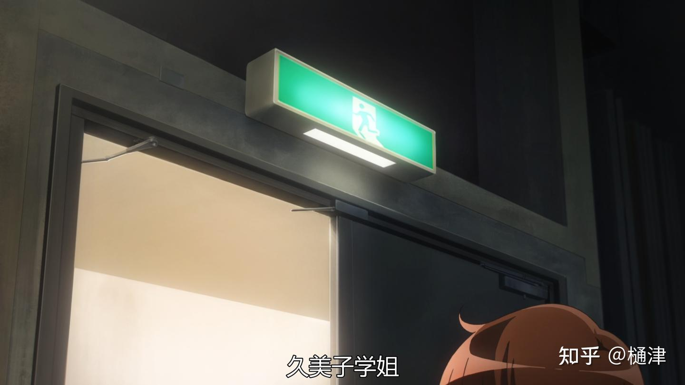

&emsp;&emsp;今年是《吹响吧！上低音号》播出的第十个年头，不知道是某种怀旧情绪在起作用的缘故，还是说在一定历史语境之外人真的能够客观，或者是时间真的可以淡化许多无所谓有无所谓无的事物，总之，许多人对吹三结局的反应从剧烈慢慢趋向于接受。

&emsp;&emsp;像是我的一位朋友，最开始他被我骗去看吹，看完第三季之后义愤填膺的，前几天突然给我转发了一个视频，大概是讲京吹三为什么不是烂尾，这就是我突然又准备写些什么的原因。

&emsp;&emsp;不过老实说，现在我对吹三的结局很难说有什么看法，可能仍然有什么不满，但或多或少想开了。有句话叫“存在即合理”，大概是黑格尔他老人家说的，这个话是有道理的，一个事物是产生它的历史语境的结果，吹三也是如此，对它或好或坏的看法也是如此。无论好坏它都是一个时代的故事，它都成了一个时代的缩影。

&emsp;&emsp;十年如梦，一转眼十年前居然是2015，那个时候社会的转向才刚刚起步，人们相信在全国铜之后经过北宇治几代人的努力将会是一个各得其所的美好结局；十年非梦，我们的今天正是在一点点过去的昨日里产生的，在往后的日子里剑崎梨梨花和久石奏虽然将北宇治吹奏部的辉煌延续了下去，北宇治虽然在日后成为了一流的吹奏强校，但是对观众来说，似乎又少了什么。

&emsp;&emsp;黄前久美子虽然没有得到最后的soli，但是她将永远是北宇治吹奏部一切底色中最重要的一缕。

&emsp;&emsp;本篇只是因为朋友要对我搞一些“文本学研究”作为一种即兴的抒发，除此之外不具备其他意义。

# 一、社团活动中的价值二重与“南中之乱”

&emsp;&emsp;京吹的一切矛盾中，社团活动中的二重价值判断应当放在第一位，**潜在的商品社会语境是久〇年矛盾的主要原因，而它又是久三年矛盾的根本。**

&emsp;&emsp;商品社会中的盲目规律构成了一种特殊的似自然性，人在其中并不完全是人，而是被生存本能驱动的经济动物，他的一切总是为维系他的存续存在的。学校的评价体系就是依托于这种似自然性存在的，人在其中评价的高低一定程度上决定了他们的生存状态。

&emsp;&emsp;为什么？因为更高的评价往往意味着更多对劳动者培养的投入以及更好的劳动能力。在私人生产者社会中劳动者培养的费用往往是由私人或者其家庭承担，而商品交换所讲究的“等价交换”原则则成为了熟练劳动者拥有更高报酬的依据——要想马儿跑，得先让马儿吃草。

&emsp;&emsp;久一年斋藤葵的剧情就是这部分现实的反映：到底是某种程度上个人价值的实现，还是将来自己商品价值的积累？在现实生存的压力之下，更多人或许会选择后者，毕竟不是每个人都是田中明日香，像明日香这种人适合和尼采的超人坐一桌。

&emsp;&emsp;回到久〇年，吹奏部糟糕的氛围就是在这种二重价值判断里生长出来的。可能在伞木希美之前还有人抨击过这种氛围，但毫无疑问，伞木希美的这一回是最剧烈、影响最大的一次。

&emsp;&emsp;有的人认为“南中之乱”这场退部运动极大破坏了北宇治吹奏部、影响了久二年的乐团阵容，是久二年北宇治折戟关西赛的主要原因。这种看法是极端错误的，因为它是以已有历史去建构所谓“应该”。可把人真的放在久〇年的限知视角之下呢？恐怕连明日香都无法想像北宇治在久一年能够站上全国的舞台。

&emsp;&emsp;从历史的发展来看，应当肯定的是，伞木希美为久一年三香改革提供了一个重要的“松动”，为低音部这样与主流相悖的“独立王国”积蓄着改革的力量，让他们看到自己坚持的一种可能。

# 二、从全国铜到关西废金

&emsp;&emsp;久一年泷升担当吹奏部顾问后的波澜壮阔在此就不多赘述，动画第一、二季已经播放得差不多，前人的研究也不少。唯一值得一提的是最近翻看《京吹学报》时的一个说法，即在明日香被迫暂时退出吹奏部后，实力至上主义在实际上遭受了波折，三香与四姬之间并非平滑过渡，而是经历了久一年声部长会议的暂时复辟，伞木希美一定程度上是为了避免和长笛声部的三年生发生像是“你才入部几天”的矛盾没有维持“实力至上”原则取代井上调的长笛首席，造成了一定资历主义的残留，最终在久二年吉川优子的努力下才重新回到改革的正轨上。

&emsp;&emsp;刚刚所述的不失为一种有趣的思路，但是在北宇治吹奏部的运行中应当看到这样一点——顾问虽然拥有决定性的力量，但是乐团的实际取决于学生，“（吹奏）部内有（声）部”、两条路线的斗争是一种常态。在久一年的一开篇也是如此，是由全部会议投票选定目标，然后顾问推着实行，因此北宇治吹奏部有这么一个奇妙的现象：顾问通过学生通行了自己的意志，新老两代学生在不知不觉间又相互绑定甚至挟持。

&emsp;&emsp;这种奇妙的制衡状态在久一年还没有显露出它的弊病，sunfes上《海兵队》演奏的成功、田中明日香的回归和最终全国铜的取得冲淡了吹奏部本身体制的矛盾，但是它在久二年极大地积蓄起来，为久三年的矛盾埋下伏笔。

&emsp;&emsp;只需要代入学生的视角就不难看出问题所在：如果一个顾问带领之前没有打进过全国赛的队伍取得了全国铜，那么这个顾问无论如何至少是比较有水平那一档的；如果一个顾问能够把恢复起来准备冲全国大赛的队伍搞到关西废金的地步，虽然和全国铜有点半斤八两，但是很难讲他的水平可以高到哪里去。

&emsp;&emsp;久一年的学生所见的就是第一种；而对久二年新生，比起泷升，黄前久美子对自己问题的解决或许作用更大些。泷升作为顾问在久二年新生的眼中大概是比较失败的，从选曲上来讲，选择《利兹与青鸟》几乎是明摆着把一切可能押在铠冢霙身上，这一行动最终导致久二年变成了对黄前十三年南中《鞑靼人舞曲》的复刻，伞木希美再次时运不济。

&emsp;&emsp;然后我们就能看到一个很奇妙的矛盾：**久一届相信顾问，久二届相信久一届但是未必信任顾问。**久二届当然相信吉川优子说的北宇治带来了最好的演奏，但是他们希望不只是吉川优子和他们觉得如此，他们也或者更希望评委觉得如此——这又回到了最初所讲的社团活动中的二重价值判断，这是根植于“社团-竞赛-社会”之中的结构性矛盾。

# 三、历史转折中的北宇治

&emsp;&emsp;久三年最初训练的氛围并不算好，吉川优子在八十人大会[^1]上的讲话虽然维护了吹奏部的团结稳定，但是这次胜利的大会却没有彻底解决问题，“为什么吹奏？”在北宇治吹奏部急需一个答案。

&emsp;&emsp;高坂在训练上的左倾是“久五逆流”的直接原因。按照一般的设想，吹奏部的建设应该是循序渐进的，但是出于对泷的绝对拥护和对关西赛的“苦亚西”（悔しい），训练逐渐产生了一种“成绩主义”的倾向，以至于南中人[^2]最开始反对的东西出于某种缓和的必要又被重新拾起来。久二年潜在的意识形态危机在久三年以这种形式爆发了，虽然黄前部长再次出面解决了问题、sunfes的胜利稳定了局面，但是还应当看到这种不同：久一年最初的伟大胜利，在久三年只能视为平常。这次危机的解决并没有提高大家对顾问的信任程度，反而是加重了大家对黄前的依赖，甚至可以说顾问的一切威信来源于黄前。

&emsp;&emsp;但是如果对“黄前久美子”的信任都遭到打击了呢？北宇治的整一个体系大概都要崩塌。黑江真由的出现虽然是完全的偶然，是武田绫乃没活了的产物，但是她又促成了一种历史矛盾爆发的必然——金奖至上主义和实力至上主义的矛盾、北宇治吹奏部“社团-竞赛-社会”三位一体的结构性矛盾……

&emsp;&emsp;动摇发生在关西赛前，实力至上主义的黄前久美子没有得到soli、受到部员尊敬的黄前久美子部长没有得到soli。在前述条件下，部员第一想到的可能是“搞不好是顾问的问题”——毕竟《利兹与青鸟》已经有过一回了，并且大号与上低音号阵容的临时改换已经搞得连黄前都对泷产生了怀疑，部员们也对“黄前久美子”产生了怀疑。

&emsp;&emsp;应当注明的一点是，这里打引号的“黄前久美子”并不是指代她个人，而是指代一种从久一年就开始的原则。理念和个人是统一的，但并不代表理念和个人不会发生冲突。**当理念和个人冲突时，黄前选择了理念。**作为乐手，她当然是希望“想要吹得更好”（上手くなりたい），希望能够和亲密战友高坂进行最终合奏；作为部长，她是“准备跌得粉碎的”，哪怕自己不能进行soli也要把自己的理念贯彻下去。

&emsp;&emsp;在一般视角中，久美子在此时似乎成为了一个“殉道者”。但简单地把久美子归于此实际上并不合适，因为殉道者总是以一种“已然”的心态面对结局，而久美子则是一方面做好了失败的准备，另一方面却坚决地进行着成功的尝试——至少从第十二集最终的选拔中，我个人所感受到的并不是对结果先定后的释然，黄前也明确说出了她觉得自己不会输。

&emsp;&emsp;“接受所不能改变的，改变可以被改变的，拥有改变的勇气，也拥有分辨的智慧。”我想这就是黄前的最后时刻。

&emsp;&emsp;黄前当然是有私心的。在第十二集她和黑江真由的对话中，“你实力至上主义四十天，我‘哑巴梨’二十天行不行”式的相处里，我们不难看出双方或多或少都有点过往创伤（被前辈压力、好友放弃音乐）和当前矛盾的叠加。**可黄前的鲜活就在于她同时作为乐手和作为部长的统一，这是并不冲突的**，尽管我未必满意吹三的结局。

# 四、在“北宇治”之外

&emsp;&emsp;作品的意义来源于其历史语境的累积，而作品则取决于作者的此在。

&emsp;&emsp;京吹三结局备受争议的隐藏语境是“2024年”。这个2024年不是我们所经历的2024年，而是从2015年延展出来的2024年，一个熟悉却又完全陌生的“明天”。

&emsp;&emsp;对于观众来说，那时的中国正迈入当代转型的第三年，一路走来的故事像是“北宇治”所呈现给我们的一般——遗憾总是存在的，但似乎希望也总是有的。《孤独摇滚》在2022年和《MyGo》在2023年成功的依托就是这种模糊的希望，三年的断裂中人们似乎发现了“自己”的所在，对连结的归复成了后疫情时代的第一个主题，社会在与个人前所未有地疏离的同时又前所未有地联系着。

&emsp;&emsp;从这层意义上来讲，京吹是个中国的故事。武吹的既定结局和吹三的播出近似于一种信号，尽管这种信号是有些颠倒的——实际上并非动画给予了希望，而是希望一直都在未曾察觉的某处——这是2022年和2023年的历史语境产生的一种历史惯性，也是断裂的三年所存在的一种必然的、迫切的、以至于急躁了的倾向，社会是需要知道它在照常运转的。**人们希望找回昨日，从昨日通往明天，忘却了今天就是明日。**

&emsp;&emsp;但是京吹又是一个日本的故事，是一个和京都动画有关的故事，是另一个2019年之后的故事。我在此确实没有对其语境做出什么具体的考察，只是经由历史隐约感觉存在一种什么源于京都动画此在的东西，它属于2015年往后，也属于2019年往后。

&emsp;&emsp;“北宇治”的作品语境也就在此断裂开来，象征的历史语境和象征的现实此在对立着。

# 五、幻痛

# 注释
[^1]: 久二年参加关西赛时的吹奏部大约有80人。
[^2]: 伞木希美和义井沙里都毕业于南中。

# 参考文献

1. 《合金装备5：幻痛》
2. 圣音小仓唯（2024）《[上梁不正下梁歪？伞木希美 —— 久三年矛盾的根源](/2024/06/04/root_cause/)》
3. -李零-（2025）《[还原真相！！今天我来告诉你！京吹3结局绝不是烂尾！](https://www.bilibili.com/video/BV1JepFzzEba/)》（BV1JepFzzEba）
4. 张一兵《马克思历史辩证法的主体向度》
5. 恩格斯《反杜林论》